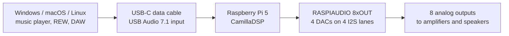
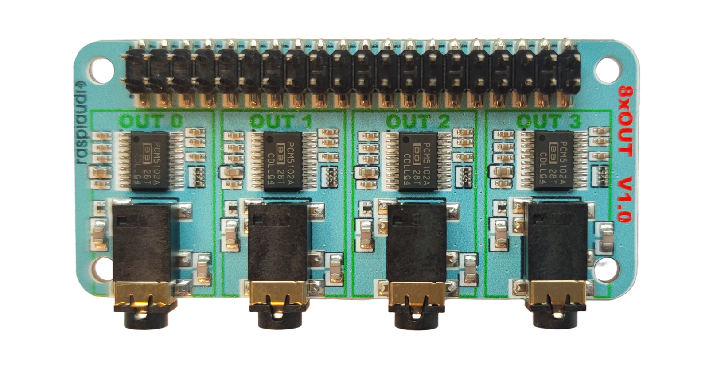

# CamillaDSP RASPIAUDIO USB in to 8-channel out

Turn a Raspberry Pi 5 into a USB 7.1 sound card with 8 analog outputs for
active speakers, DSP crossovers, EQ, gain, delay, and phase/time alignment.





## What is it for?

Use it when the music comes from a computer and you want the Raspberry Pi to do
the DSP work before the amplifiers: crossover filters, PEQ bands, gain trims,
channel routing, delay, and time/phase alignment.

The default setup is simple passthrough:

- USB input from the computer: 8 channels / 7.1 / 48 kHz
- CamillaDSP processing on the Raspberry Pi 5
- RASPIAUDIO 8xOUT analog output: 8 channels
- Default mapping: USB channel 1 to OUT1, channel 2 to OUT2, up to channel 8 to OUT8

## Raspberry Pi 5 only

This project is for Raspberry Pi 5. It uses the Pi 5 audio interface with 4 I2S
lanes, so the RASPIAUDIO board can drive 4 stereo DACs, meaning 8 output
channels.

## Checklist

- Raspberry Pi 5
- microSD card, 16 GB or larger
- Raspberry Pi OS 64-bit
- [RASPIAUDIO 8xOUT](https://raspiaudio.com/product/8xout/)
- USB-C splitter with one USB-C power input and one USB-C data connection to the computer
- Windows, macOS, or Linux computer

The same software path also works with the output side of the RASPIAUDIO
8xIN+8xOUT.

## Install

1. Flash the Raspberry Pi
   - Install [Raspberry Pi Imager](https://www.raspberrypi.com/software/).
   - Choose `Raspberry Pi 5`.
   - Choose `Raspberry Pi OS Lite (64-bit)` or `Raspberry Pi OS with desktop (64-bit)`.
   - In Imager settings, set hostname, username, password, Wi-Fi if needed, and enable SSH.
   - Write the image, insert the microSD card, mount the RASPIAUDIO board, and boot.

2. SSH into the Raspberry Pi

   ```bash
   ssh <your-user>@<raspberry-pi-ip>
   ```

3. Run the installer

   ```bash
   sudo apt update
   sudo apt install -y git
   git clone https://github.com/RASPIAUDIO/CamillaDSP.git raspiaudio-camilladsp
   cd raspiaudio-camilladsp
   sudo ./install_raspiaudio_usb_7_1.sh
   sudo reboot
   ```

4. Connect the USB-C splitter
   - Power the Raspberry Pi from the power side of the splitter.
   - Connect the data side to the computer.
   - Select the USB sound card named `RASPIAUDIO_8xOUT_USB_DSP_7_1_48k`.
   - Configure it as a 7.1 / 8-channel output device on the computer.

5. Open CamillaGUI

   ```text
   http://<raspberry-pi-ip>:5005/gui/index.html
   ```

The installer configures the USB audio gadget, the RASPIAUDIO 8-output audio
device, CamillaDSP, CamillaGUI, and the default 48 kHz passthrough profile.

## Default CamillaDSP profile

The default file is:

```text
/etc/camilladsp/raspiaudio_usb_7_1_48k_passthrough.yml
```

It starts with direct routing so you can first prove that all 8 outputs work,
then add crossover, PEQ, gain, delay, and other CamillaDSP processing.


## More details

- Beginner guide: [profiles/raspiaudio_8xout_usb_7_1_quickstart/README.md](profiles/raspiaudio_8xout_usb_7_1_quickstart/README.md)
- USB gadget details: [docs/usb_audio_gadget_pi5.md](docs/usb_audio_gadget_pi5.md)
- 2-channel USB input example: [docs/usb_gadget_2ch_to_8xout.md](docs/usb_gadget_2ch_to_8xout.md)
- 8-channel USB input example: [docs/usb_gadget_8ch_to_8xout.md](docs/usb_gadget_8ch_to_8xout.md)
