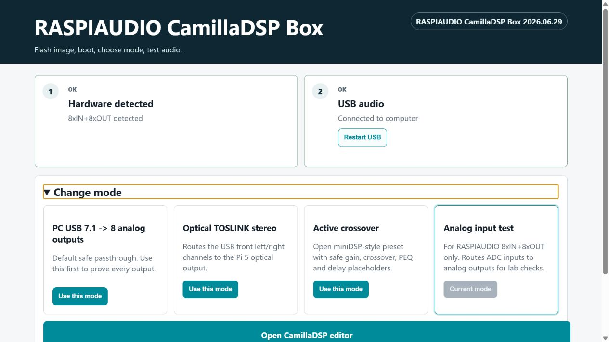
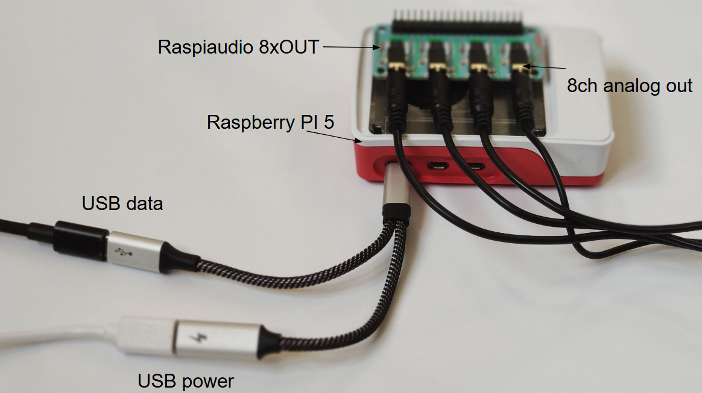
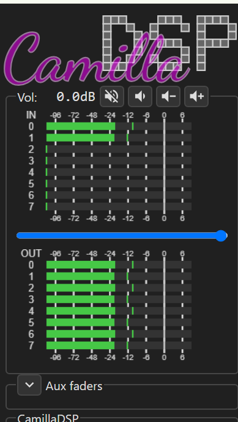
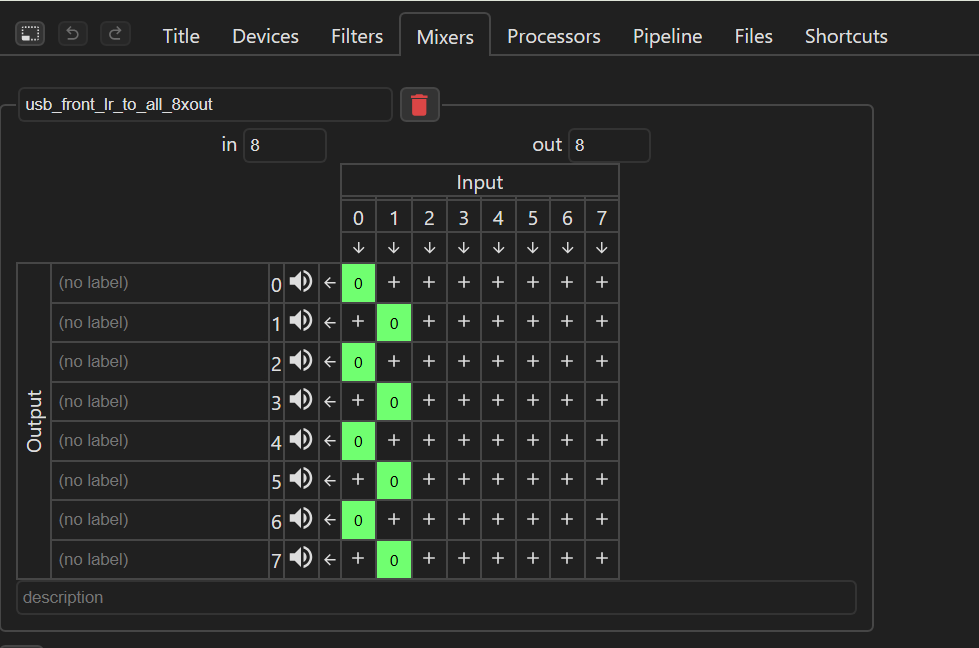
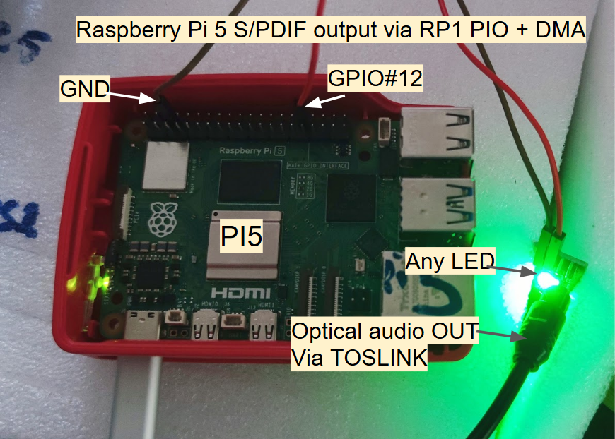
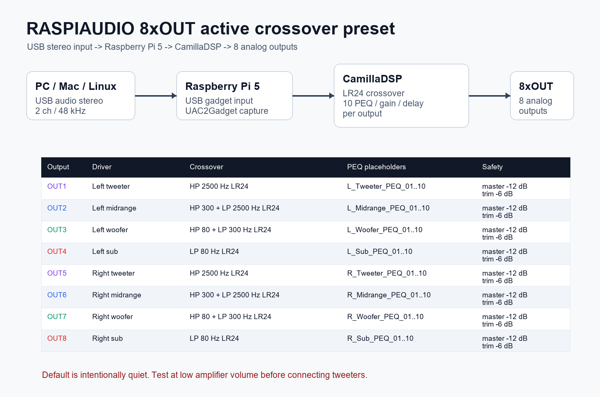

# CamillaDSP RASPIAUDIO USB in to 8-channel out

Turn a Raspberry Pi 5 into a USB 7.1 sound card with 8 analog outputs for
active speakers, DSP crossovers, EQ, gain, delay, and phase/time alignment.

## Quick Start

The recommended beginner path is the flashable RASPIAUDIO appliance image.
The public product/download page is not live yet, so this GitHub README is the
current entry point for early testers.

```text
Flash image -> boot -> open http://raspiaudio.local -> choose mode -> test audio
```

Use this mode if you want a ready-to-use audio box instead of installing Linux
packages by hand. It includes CamillaDSP, CamillaGUI, the USB 7.1 audio gadget,
RASPIAUDIO 8-output profiles, active crossover presets, TOSLINK output support,
and the simple dashboard.

1. Get the RASPIAUDIO CamillaDSP Box `.img.xz` image file.
2. Flash the image to a microSD card with Raspberry Pi Imager.
3. Mount the RASPIAUDIO 8xOUT or 8xIN+8xOUT board on a Raspberry Pi 5.
4. Boot the Pi and open `http://raspiaudio.local`.
5. Choose a mode and click the audio test buttons.

Dashboard screenshots:



Beginner flashing guide:
[docs/flash_appliance_image.md](docs/flash_appliance_image.md)

Draft public page source, for later website publishing:
[public/camilladsp-box](public/camilladsp-box)

Detailed appliance/release notes:
[docs/appliance_image.md](docs/appliance_image.md)

Candidate public images can be checked on a freshly flashed Pi with
`sudo raspiaudio-validate-release`.

Reproducible image-builder files live in [image-builder](image-builder/).




## Demo Shorts

- [Raspberry Pi 5 S/PDIF audio from a GPIO LED](https://youtube.com/shorts/jtMrTWnFblk):
  GPIO12 drives a simple LED close to a TOSLINK receiver. The signal is generated
  by the Pi 5 RP1 PIO + DMA prototype and exposed to Linux as an ALSA sound card.
- [PC USB audio into Raspberry Pi 5 CamillaDSP, then 8 outputs](https://youtube.com/shorts/2ND7hcqHV5Q):
  a USB-C power/data splitter lets the Pi stay powered while the PC sees it as a
  USB 7.1 sound card. Audio enters CamillaDSP, then goes to 8 analog outputs or
  optical TOSLINK.

Copy/paste YouTube descriptions and a community-first Reddit post are in
[docs/youtube_reddit_posts.md](docs/youtube_reddit_posts.md).

## What is it for?

Use it when the music comes from a computer and you want the Raspberry Pi to do
the DSP work before the amplifiers: crossover filters, PEQ bands, gain trims,
channel routing, delay, and time/phase alignment.

The installer starts with simple passthrough so you can prove the hardware
first:

- USB input from the computer: 8 channels / 7.1 / 48 kHz
- CamillaDSP processing on the Raspberry Pi 5
- RASPIAUDIO 8xOUT analog output: 8 channels
- Default mapping: USB channel 1 to OUT1, channel 2 to OUT2, up to channel 8 to OUT8

The main CamillaDSP use case is the open miniDSP-style active crossover preset:

- USB stereo input: 2 channels / 48 kHz
- Stereo 3-way + dual subs routing
- Linkwitz-Riley 24 dB/oct crossovers
- 10 PEQ placeholders, gain trim, and delay per output
- Safe startup attenuation: master `-12 dB`, output trims `-6 dB`

## Raspberry Pi 5 only

This project is for Raspberry Pi 5. It uses the Pi 5 audio interface with 4 I2S
lanes, so the RASPIAUDIO board can drive 4 stereo DACs, meaning 8 output
channels.

## Checklist

- Raspberry Pi 5
- microSD card, 16 GB or larger
- RASPIAUDIO CamillaDSP Box image for the recommended path
- Raspberry Pi OS 64-bit only if you choose the manual install path
- [RASPIAUDIO 8xOUT](https://raspiaudio.com/product/8xout/)
- [USB-C power/data splitter](https://amzn.to/4aZwswF)
- Windows, macOS, or Linux computer
- Free [Raspberry Pi Connect](https://connect.raspberrypi.com/) account only for the manual install path

The same software path also works with the output side of the RASPIAUDIO
8xIN+8xOUT.

## Manual Install

For the flashable product-image workflow, use the beginner guide:
[docs/flash_appliance_image.md](docs/flash_appliance_image.md)

For normal GitHub/manual installation, use the steps below.

1. Flash the Raspberry Pi
   - Install [Raspberry Pi Imager](https://www.raspberrypi.com/software/).
   - Choose `Raspberry Pi 5`.
   - Choose `Raspberry Pi OS Lite (64-bit)` or `Raspberry Pi OS with desktop (64-bit)`.
   - In Imager settings, set hostname, username, password, and Wi-Fi if needed.
   - In the Raspberry Pi Connect tab, enable Connect and link it to your account.
   - Write the image, insert the microSD card, mount the RASPIAUDIO board, and boot.

2. Open a Remote Shell
   - Go to [connect.raspberrypi.com](https://connect.raspberrypi.com/).
   - Select your Raspberry Pi.
   - Open `Remote Shell`.

3. Run the installer

   ```bash
   sudo apt update
   sudo apt install -y git
   git clone https://github.com/RASPIAUDIO/CamillaDSP.git raspiaudio-camilladsp
   cd raspiaudio-camilladsp
   sudo ./install_raspiaudio_usb_7_1.sh
   sudo reboot
   ```

4. Connect the USB-C splitter
   - Power the Raspberry Pi from the power side of the splitter.
   - Connect the data side to the computer.
   - Select the USB sound card named `RASPIAUDIO_8xOUT_USB_DSP_7_1_48k`.
   - Configure it as a 7.1 / 8-channel output device on the computer.

5. Open CamillaGUI

   ```text
   http://<raspberry-pi-ip>:5005/gui/index.html
   ```

The installer configures the USB audio gadget, the RASPIAUDIO 8-output audio
device, CamillaDSP, CamillaGUI, and the default 48 kHz passthrough profile.

## Default CamillaDSP profile

The default file is:

```text
/etc/camilladsp/raspiaudio_usb_7_1_48k_passthrough.yml
```

It starts with direct routing so you can first prove that all 8 outputs work,
then add crossover, PEQ, gain, delay, and other CamillaDSP processing.





## Optional validated TOSLINK output

The Raspberry Pi 5 can also add a validated optical S/PDIF / TOSLINK stereo
output without an extra audio chipset. In this mode CamillaDSP sends stereo
audio to the `RASPISPDIF` ALSA card, generated by the Pi 5 RP1/PIO driver, and
the signal comes out on GPIO12, physical pin 32.

The first lab tests used a simple standard LED on GPIO12 and a TOSLINK cable
held close to the LED. That was enough for the optical receiver to lock and play
clean audio. For a cleaner mechanical product, use a ready-made TOSLINK
transmitter socket/module with the LED already included; the optical principle
is the same, but cable alignment and mounting are much better.



Read the validated USB-to-TOSLINK guide:
[docs/usb_gadget_2ch_to_spdif_optical.md](docs/usb_gadget_2ch_to_spdif_optical.md)

## Active crossover preset

For an open miniDSP-style box, start from:

```text
configs/stereo_3way_dual_subs_48k_8xout.yml
```

After running the installer, the same preset is also available on the
Raspberry Pi as:

```text
/etc/camilladsp/stereo_3way_dual_subs_48k_8xout.yml
```



It maps USB stereo input to:

```text
OUT1 Left tweeter   OUT5 Right tweeter
OUT2 Left midrange  OUT6 Right midrange
OUT3 Left woofer    OUT7 Right woofer
OUT4 Left sub       OUT8 Right sub
```

Read the preset guide before connecting amplifiers and tweeters:
[profiles/stereo_3way_active_crossover_8xout/README.md](profiles/stereo_3way_active_crossover_8xout/README.md)

## More details

- Flash the appliance image: [docs/flash_appliance_image.md](docs/flash_appliance_image.md)
- Beginner guide: [profiles/raspiaudio_8xout_usb_7_1_quickstart/README.md](profiles/raspiaudio_8xout_usb_7_1_quickstart/README.md)
- Active crossover preset: [profiles/stereo_3way_active_crossover_8xout/README.md](profiles/stereo_3way_active_crossover_8xout/README.md)
- USB gadget details: [docs/usb_audio_gadget_pi5.md](docs/usb_audio_gadget_pi5.md)
- 2-channel USB input example: [docs/usb_gadget_2ch_to_8xout.md](docs/usb_gadget_2ch_to_8xout.md)
- 8-channel USB input example: [docs/usb_gadget_8ch_to_8xout.md](docs/usb_gadget_8ch_to_8xout.md)
- Raspberry Pi 5 GPIO S/PDIF OUT guide: [prototypes/pi5_spdif_gpio/README.md](prototypes/pi5_spdif_gpio/README.md)
- USB stereo to optical S/PDIF profile: [docs/usb_gadget_2ch_to_spdif_optical.md](docs/usb_gadget_2ch_to_spdif_optical.md)
- Flashable appliance image workflow: [docs/appliance_image.md](docs/appliance_image.md)
