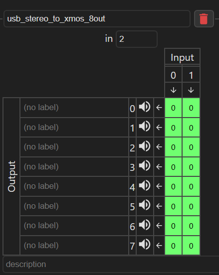
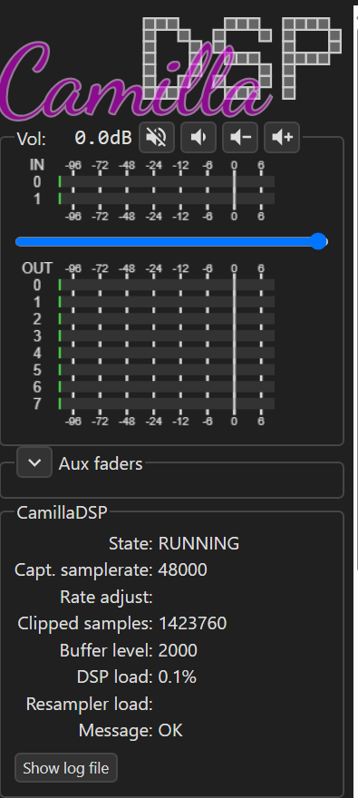

# USB 2ch input to 8ch output with CamillaDSP

This tutorial configures a Raspberry Pi 5 as a USB Audio Class 2 device for a
host computer. The host sends stereo audio over USB-C to the Pi, CamillaDSP
receives it as a 2-channel ALSA capture stream, then sends it to the RASPIAUDIO
8xOUT path through the XMOS 8-channel playback device.

Validated lab target:

- Raspberry Pi 5
- Raspberry Pi OS, 64-bit
- CamillaDSP `4.1.3`
- CamillaGUI on port `5005`
- USB gadget function: `g_audio`
- USB audio input on the Pi: `hw:CARD=UAC2Gadget,DEV=0`
- 8-channel output card: `hw:CARD=XMOSDevice,DEV=0`
- Audio format: `48000 Hz`, `S32_LE`
- CamillaDSP profile: `configs/usb_gadget_2ch_48k_to_xmos_8out.yml`

## Signal path

```text
Windows / macOS / Linux host
  USB audio stereo playback
    -> Raspberry Pi 5 USB-C gadget
    -> ALSA capture: UAC2Gadget, 2 channels
    -> CamillaDSP
    -> ALSA playback: XMOSDevice, 8 channels
    -> RASPIAUDIO 8xOUT outputs
```

Important vocabulary: the host computer sees a USB speaker/output device. On
the Raspberry Pi side, the same stream appears as an ALSA capture/input device.
That is normal for USB audio gadget mode.

## Output mapping

The default profile duplicates the stereo input to four stereo output pairs:

| USB input | Meaning | XMOS logical outputs | Physical outputs |
|---:|---|---|---|
| 0 | Left | 0, 2, 4, 6 | 1, 3, 5, 7 |
| 1 | Right | 1, 3, 5, 7 | 2, 4, 6, 8 |

This is a neutral starting point for validation. For a real crossover, keep the
same device section and replace the mixer/pipeline with filters, delays, gains,
and per-driver routing.

## Files

Copy or keep these files in the project:

```text
configs/usb_gadget_2ch_48k_to_xmos_8out.yml
docs/usb_gadget_2ch_to_8out_xmos.md
```

On the Raspberry Pi, the lab setup stores CamillaDSP files under:

```text
/home/rosco/myCamillaDSP
```

## Enable USB gadget mode

On the Raspberry Pi, enable the USB device controller on the USB-C port.

Edit `/boot/firmware/config.txt`:

```ini
[all]
dtoverlay=dwc2,dr_mode=peripheral
```

If present, disable host-only OTG mode:

```ini
#otg_mode=1
```

Load the required modules at boot.

`/etc/modules`:

```text
i2c-dev
dwc2
g_audio
```

The same content can also be placed in:

```text
/etc/modules-load.d/modules.conf
```

Create the USB audio gadget profile.

`/etc/modprobe.d/usb_g_audio.conf`:

```text
options g_audio c_srate=48000 c_ssize=4 c_chmask=3 p_chmask=0 iManufacturer=RASPIAUDIO iProduct=RASPIAUDIO_USB_DSP_2ch iSerialNumber=RASPIAUDIO-PI5-2CH idVendor=0x1d6b idProduct=0x0101
```

Meaning:

- `c_chmask=3`: stereo host-to-Pi stream
- `c_ssize=4`: 32-bit samples, `S32_LE`
- `c_srate=48000`: fixed 48 kHz
- `p_chmask=0`: no Pi-to-host microphone endpoint in this profile

For a real product, do not ship with `idVendor=0x1d6b`. Use an assigned VID/PID.

Reboot:

```bash
sudo reboot
```

## Verify USB attachment

After reboot, connect the Raspberry Pi 5 USB-C port to the host with a cable or
splitter that carries USB data. Power-only splitters will not work.

On the Pi:

```bash
cat /sys/class/udc/1000480000.usb/state
cat /sys/class/udc/1000480000.usb/function
cat /sys/class/udc/1000480000.usb/current_speed
```

Expected once the host sees the gadget:

```text
configured
g_audio
high-speed
```

Verify ALSA devices:

```bash
cat /proc/asound/cards
arecord -l
aplay -l
```

Expected:

```text
card N: UAC2Gadget
  capture: hw:CARD=UAC2Gadget,DEV=0

card M: XMOSDevice
  playback: hw:CARD=XMOSDevice,DEV=0
```

On Windows, the device should appear as a USB audio output/speaker endpoint.
PowerShell check:

```powershell
Get-PnpDevice -PresentOnly |
  Where-Object {
    $_.FriendlyName -match 'RASPIAUDIO|USB Audio|Source/Sink|Gadget' -or
    $_.InstanceId -match 'VID_1D6B&PID_0101'
  } |
  Select-Object Status,Class,FriendlyName,InstanceId
```

Typical result:

```text
USB Composite Device
USB Audio 2.0
Speakers (Source/Sink)
```

Select `Speakers (Source/Sink)` as the Windows output device and play audio.

## Install the CamillaDSP profile

From the repository on the Pi:

```bash
cd /home/rosco/myCamillaDSP
install -m 0644 configs/usb_gadget_2ch_48k_to_xmos_8out.yml \
  /home/rosco/myCamillaDSP/configs/
```

Validate the YAML:

```bash
/usr/local/bin/camilladsp --check \
  /home/rosco/myCamillaDSP/configs/usb_gadget_2ch_48k_to_xmos_8out.yml
```

Expected:

```text
Config is valid
```

## Use it as the active GUI profile

The cleanest setup is to let the service and CamillaGUI use the same active
file:

```text
/home/rosco/myCamillaDSP/configs/current.yml
```

Copy the 2-in / 8-out profile to `current.yml`:

```bash
cp /home/rosco/myCamillaDSP/configs/usb_gadget_2ch_48k_to_xmos_8out.yml \
  /home/rosco/myCamillaDSP/configs/current.yml
```

Make sure `camilladsp.service` starts CamillaDSP with `current.yml`:

```ini
ExecStart=/usr/local/bin/camilladsp -l info -o /var/log/camilladsp/camilladsp.log -w -p 1234 -s /home/rosco/myCamillaDSP/statefile.yml /home/rosco/myCamillaDSP/configs/current.yml
```

Reload and restart:

```bash
sudo systemctl daemon-reload
sudo systemctl restart camilladsp.service
sudo systemctl status camilladsp.service
```

Open CamillaGUI:

```text
http://<raspberry-pi-ip>:5005/gui/index.html
```

In the GUI:

1. Open **Files**.
2. Load `current.yml`.
3. Open **Devices** and check:
   - capture: `hw:CARD=UAC2Gadget,DEV=0`
   - capture channels: `2`
   - playback: `hw:CARD=XMOSDevice,DEV=0`
   - playback channels: `8`
4. Open **Mixers** and check `usb_stereo_to_xmos_8out`.
5. Open **Pipeline** and check that the mixer is present.
6. Press **Apply** to send changes to the running DSP.
7. Press **Save** to write changes back to `current.yml`.

The mixer should look like this:



The status panel should show CamillaDSP running, 48 kHz capture, 2 input meters,
and 8 output meters:



## Runtime checks

On the Pi:

```bash
systemctl is-active camilladsp.service
tail -80 /var/log/camilladsp/camilladsp.log
cat /proc/asound/card*/pcm*/sub*/hw_params 2>/dev/null
```

While the host is not playing audio, CamillaDSP may report:

```text
Capture device is stalled, processing is stalled
```

That is expected when the host has opened no stream or is sending no audio. Once
the host plays to `Speakers (Source/Sink)`, the stream should become active.

Expected active hardware parameters:

```text
UAC2Gadget capture:
format: S32_LE
channels: 2
rate: 48000

XMOSDevice playback:
format: S32_LE
channels: 8
rate: 48000
```

## Troubleshooting

If Windows does not see the USB audio device:

- Check that the USB-C connection carries data, not only power.
- Check `cat /sys/class/udc/1000480000.usb/state`.
- `not attached` means the host data path is not established.
- `configured` means the USB gadget has enumerated.

If CamillaGUI shows an empty or old config:

- Hard refresh the browser with `Ctrl+F5`.
- Open **Files** and load `current.yml`.
- Use **Apply** after edits to update the running DSP.
- Use **Save** after edits to update the YAML file.

If CamillaDSP fails with `Device or resource busy`:

```bash
ps -ef | grep -E '[c]amilladsp|[a]record|[a]play'
sudo fuser -v /dev/snd/*
sudo systemctl restart camilladsp.service
```

If output is heard on the wrong connector, verify the XMOS physical mapping:

```text
logical out0 -> physical output 1
logical out1 -> physical output 2
logical out2 -> physical output 3
logical out3 -> physical output 4
logical out4 -> physical output 5
logical out5 -> physical output 6
logical out6 -> physical output 7
logical out7 -> physical output 8
```

See `docs/xmos_channel_mapping.md` for the measured loopback mapping.
